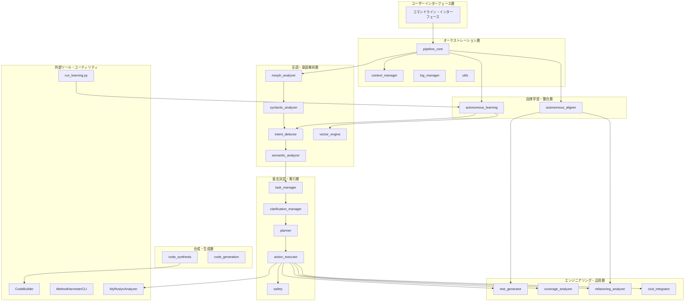

# Project Architecture: ローカル対話応答AI

本ドキュメントは、プロジェクト全体の構造、モジュール間の依存関係、およびデータフローを俯瞰するためのアーキテクチャ・マップです。

## 1. 階層型アーキテクチャ (Layered Architecture)

システムは機能的な責任に基づき、以下の階層で構成されています。



---

## 2. 主要コンポーネントの役割

### 2.1. オーケストレーション層 (Core)
*   **pipeline_core**: 全モジュールの実行順序を制御し、共通データ（コンテキスト）を管理。
*   **context_manager**: 短期記憶（対話履歴）を保持し、指示語（「それ」など）の解決を支援。
*   **log_manager**: システム全域のイベントを記録し、透明性とデバッグ可能性を担保。
*   **utils**: 共通のヘルパー関数、設計書パーサー、コンテキスト要約ツールなどを提供。

### 2.2. 言語・意図解析層 (Intelligence)
*   **morph_analyzer / syntactic_analyzer**: 日本語の形態素・構文解析。
*   **intent_detector**: 意図コーパスとベクトル類似度に基づき、ユーザーの目的（意図）を判定。
*   **semantic_analyzer**: 知識ベースを参照し、単語の持つ意味やトピックを抽出。
*   **vector_engine**: 高精度な意味類似度計算（chiVeモデル）を提供。

### 2.3. 意志決定・実行層 (Action)
*   **task_manager**: 複数ターンにわたる複雑なタスク（複合タスク）の状態遷移を管理。
*   **clarification_manager**: 不足情報や曖昧な指示に対し、ユーザーへ確認を求める対話を制御。
*   **planner**: 解析された意図を、具体的なアクション計画（メソッド名と引数）に変換。
*   **action_executor**: ファイル操作やコード解析などの実操作を担当。
*   **safety**: 実行前にアクションの安全性を検証するポリシー・バリデーター。

### 2.4. エンジニアリング・品質層 (Quality)
*   **test_generator**: ソースコードからテストケース（C#, Python, JS）を自動生成。
*   **coverage_analyzer**: テストカバレッジの測定とギャップ分析。
*   **refactoring_analyzer**: コードスメル検知とリファクタリングの提案。
*   **cicd_integrator**: CI/CD設定の生成と品質ゲートの管理。

### 2.5. 自律学習・整合層 (Evolution)
*   **autonomous_learning**: 対話ログから新しい意図パターンや用語マッピングを学習。
*   **autonomous_aligner**: 設計書（.design.md）と実装（コード）の同期状態を監視・自動修復。

### 2.6. 外部ツール・ユーティリティ (Tools)
*   **CodeBuilder**: 合成されたブループリントから C# を生成する .NET ツール。
*   **MethodHarvesterCLI**: 参照ライブラリからメソッド情報を収集する .NET ツール。
*   **MyRoslynAnalyzer**: C#コードの精密解析を行う .NET コンソールアプリ。ActionExecutor から呼び出される。
*   **run_learning.py**: 自律学習サイクルをコマンドラインから独立して実行するためのスクリプト。

---

## 3. データフロー (Context Flow)

1.  **Input**: ユーザーの生テキスト。
2.  **Enrichment**: 言語・意図解析層が意味情報を付加。
3.  **Governance**: タスク管理・安全層が実行の是非と順序を判断。
4.  **Execution**: 意志決定・実行層がエンジニアリング層や外部ツールを駆使して操作を実施。
5.  **Evolution**: 整合層が実行結果を設計書に反映し、学習層が次回以降の精度を向上。

---

## 4. 物理構造 (Main Directories)

```text
src/
├── action_executor/        # アクション実行
├── advanced_tdd/           # TDD 支援
├── autonomous_aligner/     # 設計↔実装 整合
├── autonomous_learning/    # 学習ロジック
├── cicd_integrator/        # CI/CD 生成
├── cicd_operations/        # CI/CD 操作
├── clarification_manager/  # 確認要求
├── code_generation/        # コード/プロジェクト生成
├── code_synthesis/         # 合成ロジック
├── code_verification/      # 検証・監査
├── config/                 # 設定管理
├── context_manager/        # 文脈管理
├── coverage_analyzer/      # カバレッジ分析
├── csharp_operations/      # C# 操作
├── design_parser/          # 設計書パーサ
├── file_operations/        # ファイル操作
├── intent_detector/        # 意図検出
├── ir_generator/           # IR 生成
├── log_manager/            # ログ管理
├── morph_analyzer/         # 形態素解析
├── pipeline_core/          # 実行フロー制御
├── planner/                # プランナー
├── refactoring_analyzer/   # リファクタリング分析
├── refactoring_operations/ # リファクタリング操作
├── replanner/              # 再計画
├── response_generator/     # 応答生成
├── safety/                 # 安全性検証
├── semantic_analyzer/      # 意味解析
├── semantic_search/        # ベクトル検索
├── symbol_matching/        # シンボルマッチ
├── syntactic_analyzer/     # 構文解析
├── task_manager/           # タスク管理
├── tdd_operations/         # TDD 操作
├── test_generator/         # テスト生成
├── test_operations/        # テスト操作
├── utils/                  # 共通ユーティリティ
└── vector_engine/          # ベクトルエンジン

tools/
├── csharp/
│   ├── CodeBuilder/      # ブループリント→C# 変換
│   ├── MethodHarvesterCLI/ # メソッド収集
│   └── MyRoslynAnalyzer/ # C#静的解析実体
└── learning/
    └── run_learning.py   # 学習実行エントリ

tests/
├── unit/                 # 単体テスト
├── integration/          # 結合テスト
├── security/             # セキュリティ関連テスト
├── fixtures/             # テスト用素材
└── test_projects/        # 解析・生成テスト用のプロジェクト素材

scripts/
├── data/                  # データ取得・変換
├── generate/              # 設計書/コード生成
├── validate/              # 検証・スモーク
├── sync/                  # 同期ユーティリティ
├── tools/                 # 補助ツール
└── scaffold/              # 雛形生成
```

---

## 5. 設計指針 (Design Principles)

*   **Specification-First**: すべてのモジュールは `.design.md` に基づいて実装される。
*   **Deterministic Reasoning**: ルールと知識ベースに基づく予測可能な挙動を優先。
*   **Loose Coupling**: 各モジュールは `context` オブジェクトを介してのみ結合。
*   **Self-Healing**: 実行エラーや設計の矛盾を自ら修正する能力。
