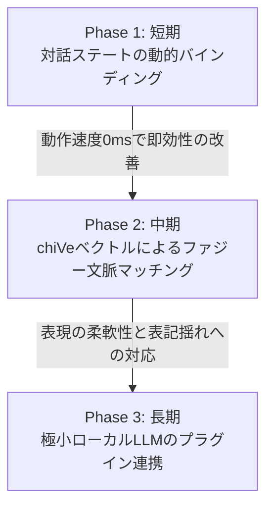

# 対話型コード生成AIへの進化と自然な応答のボトルネック解消計画

本ドキュメントは、ローカル対話応答AIにおいて、自然言語（対話パイプライン）とコード生成（TDD/設計書合成）を「自然な対話」を主役にしてシームレスに統合し、かつローカル環境という制約（軽快さ・決定性）を守りながら、対話の不自然さというボトルネックを解消するためのアーキテクチャ設計およびロードマップを定義します。

## 0. 進捗サマリ（2026-06-09 時点）

- 全体進捗の目安: 約 80%
- Phase 1: ほぼ完了
- Phase 2: 完了
- Phase 3: 設計着手

現状は、`ResponseGenerator` / `TaskManager` / `pipeline_core` を中心に、承認待ち、補足質問、割り込み復帰、TDD 実行進捗の対話統合が決定論的に動作し、chiVe を用いた主要 conversational / action intent の表記揺れ吸収も Phase 2 の完了条件を満たした状態です。Phase 3 についても、極小ローカル LLM を差し込むための no-op リライト層、設定ファイル、配線ポイント、安全ゲートまでは着手済みです。

---

## 1. 背景と課題

現在、本プロジェクトは以下の3つの入り口（Entry Points）を持っています。
1. **設計書 → コード生成** (`scripts/generate/generate_from_design.py`): 決定論的な高速変換。
2. **対話パイプライン** (`src/pipeline_core/pipeline_core.py`): 自然言語の解釈と応答。
3. **TDD支援** (`src/advanced_tdd/main.py`): 自律的なエラー修正。

### 現状の課題
* **自然言語の介在余地の不足**: 設計書からコードを生成する際、人間が厳格なDSL（中間表現タグやJSON埋め込み）を手書きする必要があり、自然な会話による指示や曖昧さを許容する余地が少ない。
* **応答の硬直性**: 対話の応答生成が静的なテンプレートに依存しているため、現在のタスクの進捗状況や、詳細なエラー情報に応じたきめ細やかな会話のバリエーションが不足している。
* **ローカル動作の制約**: クラウドの巨大なLLMを使えば解決できるが、本プロジェクトの憲章である「ローカルPCでの軽量・高速動作」を損なわずにこれらを解決する必要がある。

---

## 2. アーキテクチャ選定方針とハイブリッド設計

本計画では、「決定性（100%同じコードを生成する堅牢さ）」と「非決定性（自然で柔軟な対話）」を両立させるため、以下の**ハイブリッド・レイヤー構造**を採用します。

```
+-------------------------------------------------------------+
|               対話・コミュニケーションレイヤー               |
|      (対話のゆらぎ・自然な日常会話・曖昧さの対話的解消)       |
+------------------------------+------------------------------+
                               |
                   [意図検出・ContextManager]
                               |
                               v
+-------------------------------------------------------------+
|                決定論的コード生成レイヤー                   |
|      (設計書パーサ・IR Generator・C# CodeBuilder・TDD)       |
+-------------------------------------------------------------+
```

1. **左脳（決定論的コア）**: 設計書のパース、IR（中間表現）の生成、C# CodeBuilderとの連携、TDD自己修復などの高負荷かつ正確性が求められる処理は、従来の決定論的パイプラインが超高速に担当し続けます。
2. **右脳（ファジー・コミュニケーション）**: ユーザーとの対話、パラメータ不足の逆質問、および処理結果の日常語へのリライトだけを、動的テンプレートや極小ローカルLLMが柔らかく担当します。

---

## 3. 段階的実装ロードマップ

システムの安定性と軽量性を保つため、以下の3つのフェーズに分けて段階的に実装を進めます。



### Phase 1: 短期（即効性・決定性重視の動的バインディング）
**進捗状態: ほぼ完了**

既存の `TaskManager` や `ContextManager` が持つリアルタイムな状態情報（現在のタスク名、対象ファイル名、エラーログ）を、応答テンプレートに動的に注入し、日常会話として合成します。

* **動作特徴**: 処理時間0ミリ秒、追加メモリ消費ゼロ。
* **動作例**:
  * 承認待ちのとき: 「ありがとうございます！それでは `CalculateOrderDiscount` の仕様を満たすC#コードの合成を開始しますね。」
  * エラー発生時: 生のエラーログを日常の日本語に変換し、「コンパイル時にNullReferenceException（値が空になっている問題）が検出されました。修正コードを適用しますか？」と親切に提案。

実装済み事項:
- `task` / `action_result` / `dialogue_metadata` を用いた動的応答合成
- `recommended_action` に基づく承認文面の決定論的生成
- `pending_confirmation` と `task_clarification` の状態分離
- TDD 3 系統 (`EXECUTE_GOAL_DRIVEN_TDD` / `ANALYZE_TEST_FAILURE` / `APPLY_CODE_FIX`) の進捗・失敗・再開案内
- 承認待ち中の割り込み、再開、拒否後の新規依頼移行の統合回帰

残タスク:
- 設計書生成系や一般アクション系にも、TDD 系と同程度の会話メタデータ粒度を横展開する余地がある

### Phase 2: 中期（chiVeベクトル検索を用いた文脈ファジーマッチングの深化）
**進捗状態: 完了**

すでにローカルにキャッシュされている `chiVe`（ワードベクトル）を利用し、単語単位だけでなく文章全体のコサイン類似度で類似インテントや感情ステートを引き当てられるようにします。

* **動作特徴**: 既存のメモリモデルを使用するため、追加の依存ライブラリやモデルロードが不要。
* **動作例**: 「ファイル消して」「これ削除して」「コピーして消しちゃって」などのユーザーの多様な表記揺れを、同一のファイル削除インテント（`FILE_DELETE`）へ高度にマッピング。

実装済み事項:
- `IntentDetector` による corpus 例文の文ベクトル化とキャッシュ
- 入力文と意図コーパスのコサイン類似度比較
- 承認待ちや一部タスク状態に応じた state-dependent boost
- 削除系、コピー系、移動系、承認/拒否系、時間問い合わせ系の代表的な言い換えを unit test で回帰固定
- compound task の承認フローでも `了解` / `ノー` のような承認バリエーションを会話シナリオで固定
- `CMD_RUN` と TDD 3 系統の確認フローでも `了解` / `キャンセル` 系の応答を統合テストで固定
- `GREETING` / `TIME` の言い換えが、タスク明確化中や承認待ち中でも元の会話状態を壊さないことを実 detector 経由の会話シナリオで固定
- `PERSONAL_Q` / `BYE` についても、明確化中と承認待ち中の状態保持を実 detector 経由の会話シナリオで固定
- `WEATHER` / `CAPABILITY` / `DEFINITION` についても、明確化中と承認待ち中の状態保持を実 detector 経由の会話シナリオで固定
- 実コーパスに未登録だった `WEATHER` / `CAPABILITY` を intent corpus へ追加し、`DEFINITION` を含む conversational 短文の detector 回帰を unit test で固定
- `EMOTIVE` / `SMALLTALK` / `FEEDBACK` についても corpus・unit test・会話シナリオを追加し、明確化中は conversational 応答と再開案内、承認待ち中は元の確認プロンプト再提示が優先されることを固定

Phase 2 で意図的に見送った事項:
- conversational intent ごとの応答文面品質そのものを、代表例以上の網羅性で磨き込むこと
- 感情ステートや conversational intent の意味品質を、より長い文脈単位で最適化すること
- ローカル LLM を併用した応答リライトや文体調整

完了条件:
1. Detector 回帰:
   `FILE_DELETE` / `BACKUP_AND_DELETE` / `FILE_COPY` / `FILE_MOVE` / `AGREE` / `DISAGREE` / `TIME` / `GREETING` / `BYE` / `PERSONAL_Q` / `WEATHER` / `CAPABILITY` / `DEFINITION` / `EMOTIVE` / `SMALLTALK` / `FEEDBACK` の代表的な言い換えが `tests/unit/test_intent_detector.py` で固定されていること。
2. 状態保持回帰:
   明確化中と承認待ち中の両方で、上記 conversational intent 群の割り込みが元タスク状態を破壊しないことを `tests/integration/test_conversation_scenarios.py` で固定していること。
3. 確認フロー契約:
   承認待ち中は conversational 応答よりも元の確認プロンプト再提示が優先され、明確化中は conversational 応答と再開案内が優先されることをテストで固定していること。
4. 語彙契約:
   `resources/intent_corpus.json` に現れる conversational intent 名が `src.utils.control_intents` と `scripts/validate_project_consistency.py` の許可集合に登録されていること。
5. 設計同期:
   `intent_detector.design.md` に類似度閾値、state-dependent boost、短文 conversational boost の責務が記載されていること。

Phase 2 の完了判定:
- 上記 1〜5 を満たし、`python scripts/validate_project_consistency.py` が成功するなら、Phase 2 は完了扱いとしてよい。

Phase 3 へ持ち越すもの:
- conversational intent ごとの返答文面を自然さ・親切さ・情報量で最適化すること
- 極小ローカル LLM を使った応答リライトや文面磨き
- detector の意味品質をさらに引き上げるための高度な文脈推定

### Phase 3: 長期（極小ローカルLLMによるハイブリッド・フォールバック連携）
**進捗状態: 実装進行中**

最終応答テキストの「お化粧（リライト）」として、1B〜3Bの量子化ローカルLLM（例: `gemma-2-2b-it` など）をプラグインとして連携可能なインターフェースを定義します。

* **動作特徴**: 追加メモリ 1.5GB〜2.5GB。ハルシネーション（嘘のコード生成）を防ぐため、LLMには「コードの生成」は絶対にさせず、「左脳レイヤーが出力した処理結果の日本語要約」のみをサンドボックスプロンプトで担当させます。

実装済み事項:
- `src/response_rewriter/response_rewriter.py` に no-op 既定の `ResponseRewriter` / plugin interface / safety gate を追加
- `config/response_rewriter_config.json` を追加し、既定では `enabled: false` の deterministic 運用に固定
- `ResponseGenerator._finalize_response()` の後段に、構造化出力や長文を自動バイパスするリライト差し込み点を追加
- `Pipeline` と `ConfigManager` から `response_rewriter` 設定へ到達できる配線を追加
- `subprocess_stdio` backend を追加し、外部のローカル LLM ランナーへ JSON 契約で文面リライトを委譲できる実 backend を実装
- `persistent_subprocess_jsonl` backend を追加し、Qwen CPU runner を常駐プロセスとして再利用して毎回の model reload を避ける実運用経路を追加
- backend へ渡す payload を `contract_version` / `mode` / `input` / `constraints` / `instruction` を含む versioned contract に拡張し、stub runner と `Pipeline.run()` 経由の統合テストで contract を固定
- 承認文面・補足質問・エラー応答を既定では rewrite 対象外にし、明示設定時だけ許可する safety gate を追加
- 左脳レイヤー出力の要約専用プロンプト仕様を、`instruction` と `constraints` を持つ versioned contract として明文化
- `Qwen2.5-3B-Instruct` を `Transformers` 直実行・CPU 前提で呼び出す runner (`scripts/response_rewriter_qwen_cpu.py`) と、その prompt/messages 契約を追加
- 常駐 server wrapper (`scripts/response_rewriter_qwen_cpu_server.py`) を追加し、JSONL で複数リクエストを処理できるようにした
- `response_rewriter_config.json` に `${PYTHON_EXECUTABLE}` / `${WORKSPACE_ROOT}` を使った実運用向け command 既定値を追加し、依存導入後は `enabled: true` で persistent Qwen CPU runner を呼べるようにした

未完了事項:
- 実際の Qwen runner を使う長時間系の手動ベンチマークと、常駐時の応答時間計測を整理すること
- リライト結果の安全制約を、実 backend を使う end-to-end テストまで広げること

運用補助:
- `scripts/benchmark_response_rewriter.py` で one-shot と persistent の応答時間を同一 payload で比較できるようにし、CPU 実機での導入判断をしやすくする。
- CPU 運用の既定 `QWEN_REWRITER_MAX_NEW_TOKENS` は短文自然化向けに 32 へ絞り、まず生成長を抑えた状態でレイテンシを計測する。
- `openai_compatible_http` backend を追加し、`llama.cpp server` などのローカル OpenAI 互換 endpoint へ同一 rewrite contract を流せるようにして、実行基盤だけを差し替えやすくする。
- `scripts/benchmark_response_rewriter.py` に http 計測モードを追加し、`llama.cpp server` の `/v1/chat/completions` を直接ベンチできるようにする。
- `scripts/inspect_response_rewriter_quality.py` を追加し、固定ケース群で「実際に自然化したか」「安全ゲートで維持されたか」をまとめて確認できるようにする。
- quality CLI は `family_summary` と `case_ids_by_assessment` を返し、`--family deterministic_progress` で標準進捗テンプレートだけ、`--family deterministic_success` で標準成功文だけを切り出して再計測できるようにする。
- `deterministic_progress` と `deterministic_success` は rewrite しない前提の preserve ケースとして扱い、標準文面はまず deterministic の自然さを優先する。
- 現在の既定 allow-list は conversational intent 群のうち `GENERAL` / `WEATHER` / `TIME` / `CAPABILITY` を除いた集合とし、rewrite は主に雑談・感情応答・フィードバック系の conversational 応答に限定する。
- LM Studio の OpenAI 互換 server で定常 2.6 秒前後、品質確認でも `semantic_regression: 0` / `unexpected_rewrite: 0` までは到達した。
- ただし通常応答の自然化品質はまだ安定して改善できていないため、backend 候補は `openai_compatible_http` としつつ、既定 `enabled` は false のまま保持する。
- `scripts/run_response_rewriter_conversation_probe.py` を追加し、実 backend を使った複数ターン会話の自然化有無と clarification 維持をターン単位で確認できるようにする。
- 安定化のため、rewrite 対象を conversational intent 群と `GENERAL` に限定する allow-list と、`action_result.status == success` に絞る allow-list を追加し、作業系完了文や途中状態の rewrite を既定で抑制する。
- シナリオテストでは、通常会話ターンのみ rewrite され、clarification 中の割り込み応答と作業完了メッセージは deterministic に維持されることを固定する。

要約専用プロンプト仕様:
1. 入力:
   backend には `input.response_text` を主対象として渡し、`original_text`, `intent`, `dialogue_state`, `task_name`, `action_status` は文脈補助としてのみ渡す。
2. 禁止事項:
   事実追加、コード生成、コマンド提案、Markdown block 追加、Mermaid 追加、ファイルパス改変、承認条件の書き換えは禁止する。
3. 許可事項:
   語尾調整、冗長表現の圧縮、日本語としての自然化、敬体への統一だけを許可する。
4. 出力契約:
   backend は `{ "text": "..." }` を返し、`response_text` の情報量を維持しつつ `constraints.max_length_ratio` を超えない。
5. 優先順位:
   `constraints` は runner 側の自由判断より優先し、違反の疑いがあれば空応答または原文返却相当で失敗してよい。

---

## 4. 影響を受けるコンポーネントと変更方針

### Response Generator (`src/response_generator/`)
**進捗状態: ほぼ完了**

* `generate()` および `_finalize_response()` メソッドを拡張し、コンテキストから `task_info` や `action_result` の詳細なメタデータを抽出して応答テンプレートへ注入するバインディング処理を追加。
* エラーログを人間向けに噛み砕くための「エラー対応テーブル（翻訳辞書）」の内包。

### Knowledge Base (`resources/`)
**進捗状態: ほぼ完了**

* `custom_knowledge.json` に、プレースホルダー（例: `{task_name}`、`{target}`、`{error_detail}`）を含んだ、進捗・エラー報告用の新しい動的対話テンプレートを拡充。

### Intent Detector / Vector Engine (`src/intent_detector/`, `src/vector_engine/`)
**進捗状態: 部分対応**

* 文章全体のコサイン類似度によるファジー意図判定のブーストロジックを実装。

---

## 5. 検証プラン

### 自動テスト
**進捗状態: 大半完了**

1. **ResponseGenerator 単体テストの拡充**: `tests/unit/test_response_generator.py` にて、様々な `task_info` や `action_result` のモックを入力した際に、動的に日常語のメッセージが正しく合成されるかをアサーション検証。
2. **プロジェクト一貫性検証**:
   ```powershell
   python scripts/validate_project_consistency.py
   python scripts/sync_project_map.py
   ```

補足:
- `ResponseGenerator` 単体テストに加え、`test_pipeline_core.py` / `test_full_integrated_pipeline.py` / `test_conversation_scenarios.py` で承認待ち・割り込み・TDD 進捗報告の統合回帰を追加済み
- `validate_project_consistency.py` は resource 語彙検証まで拡張済み

### 手動検証（シナリオ確認）
**進捗状態: 部分対応**

1. チャット経由で「CalculateOrderDiscount の機能を実装して」と入力し、AIが TDD 実行やコンパイルの進捗状況を、チャットで段階的に進捗報告することを確認。
2. 意図的に失敗する設計書を入力し、AIがエラーコードから親切な修正提案を作成して会話してくるかを確認。

補足:
- 上記シナリオの多くは自動化された統合テストで代替できる状態まで来ている
- ただし、実際の対話体感を確認する手動シナリオはまだ整理し切れていない
