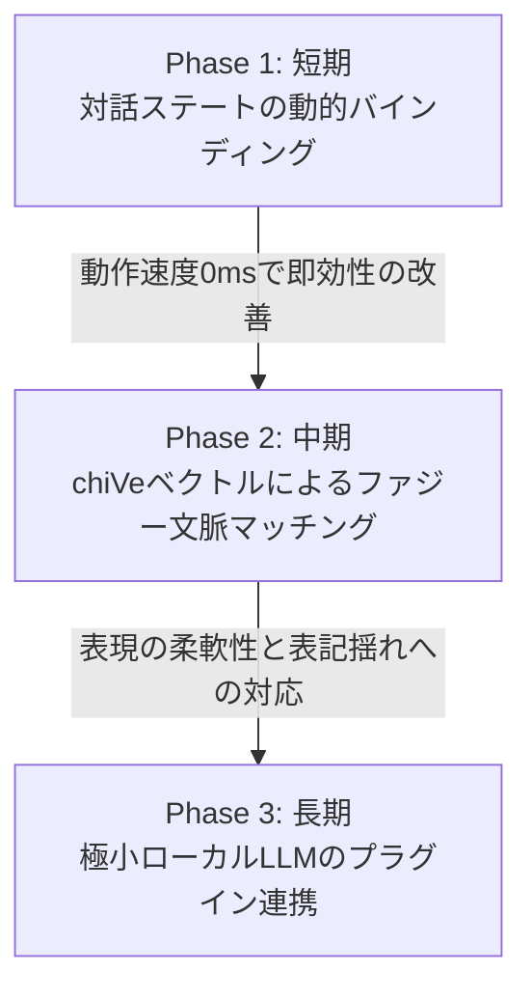

# 対話型コード生成AIへの進化と自然な応答のボトルネック解消計画

本ドキュメントは、ローカル対話応答AIにおいて、自然言語（対話パイプライン）とコード生成（TDD/設計書合成）を「自然な対話」を主役にしてシームレスに統合し、かつローカル環境という制約（軽快さ・決定性）を守りながら、対話の不自然さというボトルネックを解消するためのアーキテクチャ設計およびロードマップを定義します。

---

## 1. 背景と課題

現在、本プロジェクトは以下の3つの入り口（Entry Points）を持っています。
1. **設計書 → コード生成** (`scripts/generate/generate_from_design.py`): 決定論的な高速変換。
2. **対話パイプライン** (`src/pipeline_core/pipeline_core.py`): 自然言語の解釈と応答。
3. **TDD支援** (`src/advanced_tdd/main.py`): 自律的なエラー修正。

### 現状の課題
* **自然言語の介在余地の不足**: 設計書からコードを生成する際、人間が厳格なDSL（中間表現タグやJSON埋め込み）を手書きする必要があり、自然な会話による指示や曖昧さを許容する余地が少ない。
* **応答の硬直性**: 対話の応答生成が静的なテンプレートに依存しているため、現在のタスクの進捗状況や、詳細なエラー情報に応じたきめ細やかな会話のバリエーションが不足している。
* **ローカル動作の制約**: クラウドの巨大なLLMを使えば解決できるが、本プロジェクトの憲章である「ローカルPCでの軽量・高速動作」を損なわずにこれらを解決する必要がある。

---

## 2. アーキテクチャ選定方針とハイブリッド設計

本計画では、「決定性（100%同じコードを生成する堅牢さ）」と「非決定性（自然で柔軟な対話）」を両立させるため、以下の**ハイブリッド・レイヤー構造**を採用します。

```
+-------------------------------------------------------------+
|               対話・コミュニケーションレイヤー               |
|      (対話のゆらぎ・自然な日常会話・曖昧さの対話的解消)       |
+------------------------------+------------------------------+
                               |
                   [意図検出・ContextManager]
                               |
                               v
+-------------------------------------------------------------+
|                決定論的コード生成レイヤー                   |
|      (設計書パーサ・IR Generator・C# CodeBuilder・TDD)       |
+-------------------------------------------------------------+
```

1. **左脳（決定論的コア）**: 設計書のパース、IR（中間表現）の生成、C# CodeBuilderとの連携、TDD自己修復などの高負荷かつ正確性が求められる処理は、従来の決定論的パイプラインが超高速に担当し続けます。
2. **右脳（ファジー・コミュニケーション）**: ユーザーとの対話、パラメータ不足の逆質問、および処理結果の日常語へのリライトだけを、動的テンプレートや極小ローカルLLMが柔らかく担当します。

---

## 3. 段階的実装ロードマップ

システムの安定性と軽量性を保つため、以下の3つのフェーズに分けて段階的に実装を進めます。



### Phase 1: 短期（即効性・決定性重視の動的バインディング）
既存の `TaskManager` や `ContextManager` が持つリアルタイムな状態情報（現在のタスク名、対象ファイル名、エラーログ）を、応答テンプレートに動的に注入し、日常会話として合成します。

* **動作特徴**: 処理時間0ミリ秒、追加メモリ消費ゼロ。
* **動作例**:
  * 承認待ちのとき: 「ありがとうございます！それでは `CalculateOrderDiscount` の仕様を満たすC#コードの合成を開始しますね。」
  * エラー発生時: 生のエラーログを日常の日本語に変換し、「コンパイル時にNullReferenceException（値が空になっている問題）が検出されました。修正コードを適用しますか？」と親切に提案。

### Phase 2: 中期（chiVeベクトル検索を用いた文脈ファジーマッチングの深化）
すでにローカルにキャッシュされている `chiVe`（ワードベクトル）を利用し、単語単位だけでなく文章全体のコサイン類似度で類似インテントや感情ステートを引き当てられるようにします。

* **動作特徴**: 既存のメモリモデルを使用するため、追加の依存ライブラリやモデルロードが不要。
* **動作例**: 「ファイル消して」「これ削除して」「コピーして消しちゃって」などのユーザーの多様な表記揺れを、同一のファイル削除インテント（`FILE_DELETE`）へ高度にマッピング。

### Phase 3: 長期（極小ローカルLLMによるハイブリッド・フォールバック連携）
最終応答テキストの「お化粧（リライト）」として、1B〜3Bの量子化ローカルLLM（例: `gemma-2-2b-it` など）をプラグインとして連携可能なインターフェースを定義します。

* **動作特徴**: 追加メモリ 1.5GB〜2.5GB。ハルシネーション（嘘のコード生成）を防ぐため、LLMには「コードの生成」は絶対にさせず、「左脳レイヤーが出力した処理結果の日本語要約」のみをサンドボックスプロンプトで担当させます。

---

## 4. 影響を受けるコンポーネントと変更方針

### Response Generator (`src/response_generator/`)
* `generate()` および `_finalize_response()` メソッドを拡張し、コンテキストから `task_info` や `action_result` の詳細なメタデータを抽出して応答テンプレートへ注入するバインディング処理を追加。
* エラーログを人間向けに噛み砕くための「エラー対応テーブル（翻訳辞書）」の内包。

### Knowledge Base (`resources/`)
* `custom_knowledge.json` に、プレースホルダー（例: `{task_name}`、`{target}`、`{error_detail}`）を含んだ、進捗・エラー報告用の新しい動的対話テンプレートを拡充。

### Intent Detector / Vector Engine (`src/intent_detector/`, `src/vector_engine/`)
* 文章全体のコサイン類似度によるファジー意図判定のブーストロジックを実装。

---

## 5. 検証プラン

### 自動テスト
1. **ResponseGenerator 単体テストの拡充**: `tests/unit/test_response_generator.py` にて、様々な `task_info` や `action_result` のモックを入力した際に、動的に日常語のメッセージが正しく合成されるかをアサーション検証。
2. **プロジェクト一貫性検証**:
   ```powershell
   python scripts/validate_project_consistency.py
   python scripts/sync_project_map.py
   ```

### 手動検証（シナリオ確認）
1. チャット経由で「CalculateOrderDiscount の機能を実装して」と入力し、AIが TDD 実行やコンパイルの進捗状況を、チャットで段階的に進捗報告することを確認。
2. 意図的に失敗する設計書を入力し、AIがエラーコードから親切な修正提案を作成して会話してくるかを確認。
